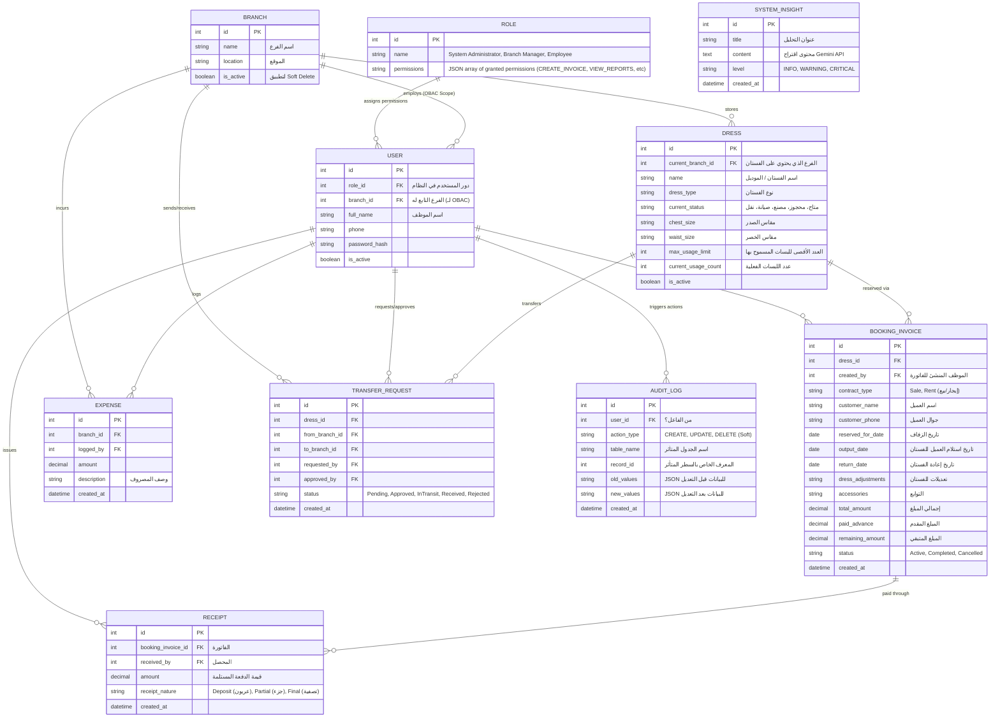

# مخطط الكيانات والعلاقات (ERD) - نظام "ليالي العُمر"

يمثل الـ Diagram التالي البنية التحتية لقاعدة البيانات (Database Schema)، مع مراعاة كافة العلاقات التي تدعم الـ (RBAC)، سجلات التدقيق، وسير الحجوزات.

