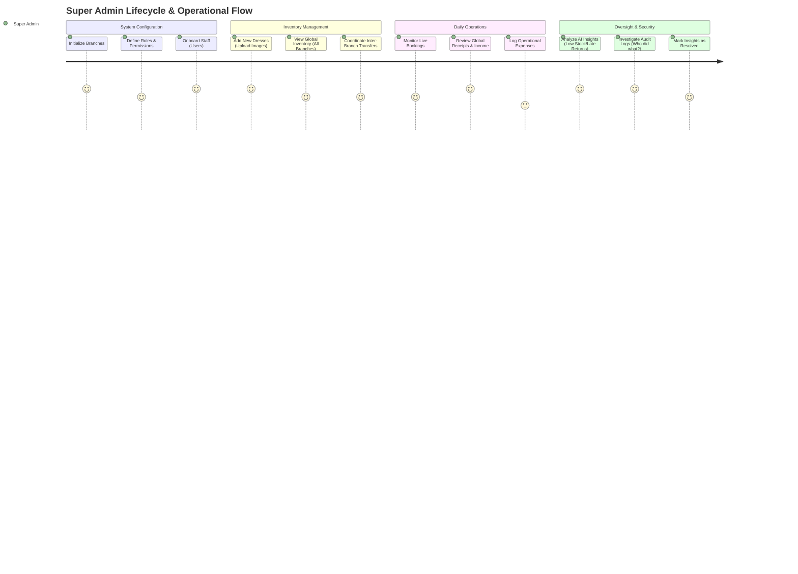

# Super Admin - Full Journey Diagram

This diagram illustrates the comprehensive operational and administrative flow for a Super Admin within the Layali Al-Omr system.

## Key Capabilities

### 1. Global Visibility
Unlike Branch Managers who are restricted to their own location, the Super Admin has a "God View."
- **Inventory:** Can see the status and location of every dress in the company.
- **Finances:** Can see the total revenue and expenses across the entire organization.

### 2. Infrastructure Control
Only the Super Admin can:
- **Create new Branches** as the business expands.
- **Modify User Roles** and their specific permissions.
- **Manage the Audit Trail** to ensure staff accountability.

### 3. Logistics Mastery
The Super Admin acts as the central coordinator for **Transfers**. When Branch A needs a dress that is currently at Branch B, the Super Admin can oversee the transfer request lifecycle from `Transit` to `Received`.

### 4. Strategic Insights
The **System Insights** module provides the Super Admin with automated alerts:
- **Low Usage:** Identifying dresses that aren't being rented.
- **Late Returns:** Tracking customers who haven't returned dresses on time.
- **Branch Performance:** Comparing which locations are generating the most revenue.
