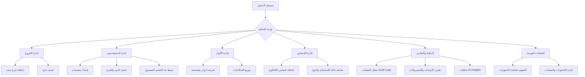

# رحلة المستخدم الخارق (Super User Journey)

هذا الرسم التوضيحي يشرح المهام والعمليات التي يقوم بها المستخدم الخارق (Super Admin) في نظام "ليالي العمر".

## تفاصيل الرحلة:
1. **التهيئة:** يبدأ المستخدم الخارق بإنشاء الفروع (Branches) ثم تعريف الأدوار (Roles) وتوزيع الصلاحيات المناسبة.
2. **التشغيل:** يتم إنشاء حسابات الموظفين (Users) وتعيينهم في الفروع المناسبة مع تحديد سقف الخصم لكل منهم.
3. **المخزون:** إضافة الفساتين (Dresses) وتحديد أسعار الإيجار والبيع وحالات التوافر.
4. **المراقبة:** استخدام لوحة التحكم لمتابعة الإيرادات اليومية، وفحص سجل العمليات (Audit Logs) لضمان الشفافية، ومراجعة تحليلات الذكاء الاصطناعي (Insights) لتحسين الأداء.
5. **التخطيط:** استخدام التقويم المركزي (Calendar) للحصول على نظرة شاملة على جميع الحجوزات في كافة الفروع.
